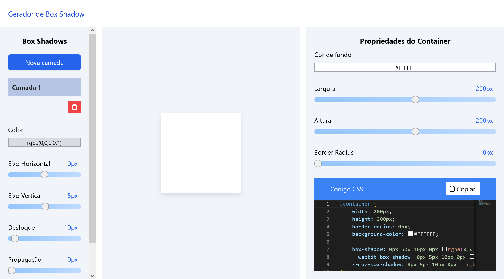

# 📦 **Gerador de Box Shadow**

Um aplicativo simples para gerar e personalizar efeitos de sombra para um elemento.

## ℹ️ **Sobre o Projeto**

Este é um gerador interativo de *box shadow* que permite aos usuários ajustar várias propriedades, como deslocamento horizontal e vertical, espalhamento, desfoque, cor e muito mais para criar efeitos de sombra personalizados. Você pode acessá-la [neste link.](https://gerador-box-shadow.netlify.app/)

## 🛠️ **Tecnologias Utilizadas**

- React: para a construção da interface interativa.
- Tailwind CSS: para estilização rápida e prática dos componentes.
- Vite: para o ambiente de desenvolvimento e construção do projeto.

## 🎨 **Funcionalidades Principais**

- **Customização do Box Shadow:** Os usuários podem ajustar propriedades como eixos X e Y, espalhamento, desfoque e cor para criar uma variedade de efeitos de sombra.
- **Controle do Container:** Além do box shadow, é possível alterar o tamanho, largura, border-radius e cor de fundo do container.
- **Cópia de Código CSS:** O aplicativo permite aos usuários visualizar e copiar o código CSS das propriedades personalizadas a qualquer momento, facilitando a implementação dessas sombras personalizadas em outros projetos.

## 💡 **Instruções de Uso**

1. **Personalize o Box Shadow:**
   - Ajuste os valores de eixo X, eixo Y, espalhamento, desfoque e cor para criar o efeito de sombra desejado.
2. **Modifique as Propriedades do Container:**
   - Altere o tamanho, largura, border-radius e cor de fundo do container conforme desejado.
3. **Copie o Código CSS:**
   - Quando satisfeito com o efeito de sombra criado, copie o código CSS gerado para aplicar em seu projeto.

## 🚀 **Como Executar o Projeto Localmente**

1. **Clonagem do Repositório:**
   - Clone este repositório para o seu ambiente local usando  `git clone https://github.com/gabrielsantos7/box-shadow-generator.git`
2. **Instalação de Dependências:**
   - Execute `npm i` para instalar as dependências necessárias.
3. **Iniciar o Servidor de Desenvolvimento:**
   - Execute `npm run dev` para iniciar o servidor de desenvolvimento.
4. **Acesso ao Aplicativo:**
   - Abra o navegador e acesse `http://localhost:5173` para visualizar e interagir com o gerador de box shadow.

## 📜Licença

Este projeto é licenciado sob a [Licença MIT](https://opensource.org/license/mit/), o que significa que você é livre para usá-lo e modificá-lo como quiser.

## 📝 **Notas Adicionais**

- Certifique-se de explorar todas as possibilidades de personalização oferecidas pelo gerador de box shadow para criar efeitos únicos e sob medida.
- Sinta-se à vontade para contribuir com melhorias ou relatar problemas no repositório do projeto.

## Imagem do site🖼️

Espero que esta ferramenta simplifique a criação e implementação de efeitos de sombra personalizados para seus elementos! ✨
